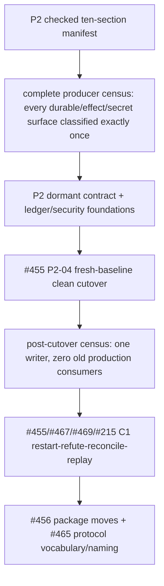

# Architecture — The Kernel in Code

This document maps [Core Model](core-model.md) onto the codebase: the target structure, the measured gap, and the migration order. Grounded in the 2026-07 full-package audit (42-agent adversarially-verified sweep) plus direct code inspection.

## Communication: Three Verbs, One Exception

Target: `ingress.submit` admits world input to the kernel; `resolveRoute` determines authority, correlation, target, session, and execution path; `dispatch.submit` is used only when the selected path crosses into a Worker or another external/shared effect; `bus.publish` is best-effort observation/projection only. Resident conversation may execute in-process without dispatch. The same-domain Worker-local `child_agent` is the only non-gate path, carries no allocation authority, and is never available to the Resident. Durable record-before-act is a separate ledger operation, not a communication verb.

Current route, policy, and execution wiring is intentionally not duplicated here; see [Implementation Status](implementation-status.md), especially the unified inbound-routing and three-layer message-flow rows.

## Ledger: One Fresh-Baseline Write Authority

Revision 9 is Owner-approved as an **undeployed complete clean break**. The P2 target is exactly one append-only ledger and exactly one authoritative writer: per-owner-key serialized compare-and-append through `Ledger.append(event, expectedHead)`. Sessions, traces, WorkItems, attempts, waits, and evidence become projections of that ledger; `bus.publish` remains lossy observation only. Production has not switched to this target; [Implementation Status](implementation-status.md) is the sole current-wiring truth.

The cutover starts from a fresh database baseline. There is no legacy-row import, compatibility reader, upcast bridge, shadow/dual writer, or mixed old/new runtime. Existing development data is disposable because the Owner confirmed that this system is undeployed. `WorkerRun`, PendingAsk/PendingInteraction backing, and the current WorkItem store are replaced rather than translated. Generic future event evolution still uses new event versions rather than changing field meaning; that is distinct from carrying pre-P2 storage into this clean break.

Kernel requirement: **agent-greppable export** of transcripts and the ledger. The target export is derived, regenerable JSONL over SQLite, one wide flat event per line. Governor analysis gets selective, analysis-scoped, audited raw access; raw payload stays outside user-facing sessions and grants no write or loosening authority. #455 owns the ledger, fresh-baseline cutover, fold, and export; #467 owns deterministic verification and replay conformance over that export.
### P2-04 replacement invariant

P2-04 replaces, rather than wraps or promotes, Bus-observer persistence. Each authoritative transition and external-effect intent must await `Ledger.append(event, expectedHead)` before act; CAS conflict, unavailable storage, or required-projection failure denies the operation with a typed error. `bus.publish` remains best-effort downstream observation. Neither a Bus emission nor a hash-chained `bus_event` journal row is authoritative, restart-durable evidence, or a fallback for ledger provenance. Failures must cross the sanitizer into the required error sink, alert counters, and an Owner-visible incident without secret payload. Current fallback and consumer inventory lives only in [Implementation Status](implementation-status.md).

## Policy: Complete the Existing Hook Layer

**Target policy topology:** policy is a system-wide, actor-agnostic interception plane. Registrations may apply to Resident, Worker, Jester, Governor, ingress, route resolution, boundary dispatch, memory, scheduling, tools, LLM connections, and writeback according to actor profile and immutable structured context. Every point validates its input and required context before middleware, applies its declared fail policy, limits effects to declared capabilities, and emits point/version attribution. `child_agent` remains Worker-only, bounded by the parent grant, non-nestable, and allocation-free. The meta-policy permits the Owner to change policy, permits the Governor only to tighten it, and grants no such authority to other actors. Current point registrations, consumers, and role-specific gaps live only in [Implementation Status](implementation-status.md).

### P2 foundation ownership

The target boundary is fixed: protocol owns versioned structure; session owns ledger storage, CAS, blobs, query, and projections; the OpenOmni kernel owns product meaning, native transition selection, verification admission, and effect-scope resolution; the server composes explicit ports and owns durable boot-reconciliation orchestration; LLM owns credential sources, `SecretRegistry`, the one boundary sanitizer, provider behavior, and the non-authoritative derived model-catalog cache. Coordinator ownership stops at worker process supervision/restart and IPC. None of these foundations by itself is a production consumer. Shipped versus dormant status appears only in [Implementation Status](implementation-status.md).

## Package Rings

```
ring 0  @openomni/protocol      schemas only ("structure over instruction", physically)
ring 1  @openomni/ledger        (rename of session) bus + session + work-item + trace + actor stores
        @openomni/policy        pure judgment + the relocated engine
ring 2  @openomni/llm           model access
        @openomni/coordinator   worker process driver — verb is deliver, never a gate
ring 3  @openomni/agent         the LLM execution loop
ring 4  @openomni/kernel        (rename + shrink of openomni) ingress + dispatch
ring 5  apps/server             channel adapters + composition root; zero direct ledger imports
```

The target ring invariant is strictly inward-only dependencies, with cross-package imports through package root barrels and no server-to-agent-loop bypass. `script/check-deps.ts` currently checks an exact allowlist for today's package manifests and source imports; it does not yet establish the target renamed ring topology. P3 (#456/#465) performs the moves and makes that strict inward ring guarantee enforceable. Current enforcement scope is recorded in [Implementation Status](implementation-status.md).

## Extraction / Merge / Delete Ledger

**Extract (wrong home → right home):** PolicyEngine agent → policy (done — #451); Bus session → ledger core; PendingAsk correlation server → kernel.

**Merge (two implementations → one):** WorkerRun → WorkItem.attempts; ingress's worker spawn/cancel/deliver → dispatch handlers (coordinator becomes the `deliver` driver beneath them); tool-executor double pipeline → one kernel path with a single audit emission; server session back doors → ledger/dispatch APIs.

**Delete (audit-confirmed dead, ~5–6k LOC):** openomni `extension/` (entire), `profile/`, and all of `skill/` (done — #453 sweep; the audit expected SkillLoader to survive, but its only importers were `extension/*` and the server has its own SkillLoader) — the policy resolver, initially listed here as orphaned, is instead retained and wired by #462's gate-side stamping; server connector registry/discovery/definitions and `router.ts` (done — #453 sweep; `resolveAgentName`'s result was discarded by `buildInboundEvent(_agentName)`); session storage drizzle tree + dep, Snapshot, backgroundTask adapter, WalMaintenance (done — #453 sweep); coordinator `credentials/` and `tool-permission/` (done — #461); 6 of 7 llm error classes (done — #453 sweep; **the llm retry stack survived reconciliation**: `processor/index.ts` drives `Retry.isRetryable/delay/sleep` on the production path — the audit's "unreachable, maxRetries: 0" only described the AI-SDK option, not the package's own loop); agent writeback-policy, empty tools barrel, write-only AgentRegistry (done — #453 sweep).

**Hygiene:** re-derived on post-sweep main and executed (the audit-time counts 31/68 and 29 described the pre-#473 tree): 1 re-export-only barrel inlined (`event/index.ts` — the dead-code sweep had already removed the rest of the farm), 20 sub-30-LOC single-importer micro-files merged into their importers, cheap standalone-"runtime" string fixes applied. Structural "runtime" renames (`DispatchRuntime`, `ResidentRuntime`, `execution-runtime/`, `agent/src/runtime/`, the `InboundEvent.runtime` protocol field — a Greg-Young-lint upcast case, never a rename) are P3 surface (#456/#465).

**Recurrence guard: abstraction is earned.** No extraction before a second consumer exists — the same evidence-based promotion pattern as Workers and data ingestion. Every dead module above was a pre-extracted abstraction.

## Code Conventions (absorbed from ADR-001–004)

- **Namespaces over classes.** Public API is `Namespace.method()`, never `new Class()`. `new` is internal-only; no inheritance hierarchies; state via module-level variables or injected `configure()` patterns. Sole exception: `NamedError.create()` (needed for `instanceof`).
- **Zod-first types.** Every cross-package contract is a Zod schema first, `z.infer<>` second, sharing one name. No standalone `interface` for shared contracts; validate at boundaries with `.parse()`; discriminated unions for state shapes. Runtime-only members extend via `&` intersection.
- **Strict inward dependencies (P3 target).** Each final ring depends only inward; reverse imports are build failures; cross-package imports use root barrels; server agent work enters through the kernel. Today's exact dependency allowlist is narrower evidence about the current graph, not this future topology; P3 owns the guarantee.
- **Stateless ChatAgent.** The agent loop is a function-style primitive (messages + tools in, events out via `AsyncGenerator`); it owns no session lifecycle or durable state — sinks and transports are injected. Session-backed orchestration lives above it. Extension happens through the policy engine, not subclassing.
- **Native tools first.** First-party capabilities are in-process native tools; MCP is reserved for genuinely external boundaries. Wrapping our own code behind MCP adds a serialization hop and hides it from the policy pipeline.
- **Scheduling is deferred ingress.** A scheduled job is `ingress.submit` with a later timestamp — there is no separate queue subsystem or queue tool; cron fires back into the same single entry path.

## Runtime resolution invariant

Agent identity and model provenance are explicit inputs. Unknown agents, absent model configuration, or invalid model references deny before Resident construction, session resolution, or Worker spawn; target architecture has no default-model substitution path. Current wiring evidence lives only in [Implementation Status](implementation-status.md).

## Migration Phases

### P2–P4 execution map

This is the target dependency order, not shipped-state evidence. [Implementation Status](implementation-status.md) remains the source of truth for current wiring.



**Owner-approved P2-00 decision (revision 9).** OpenOmni is undeployed, so #455 performs a complete clean break onto one fresh-baseline ledger. No compatibility layer, legacy upcast/import, dual writer, or shadow production path is permitted. The checked manifest and census are gates, not evidence of cutover: the ten manifest sections classify the final schema, store and writer, native transitions, blob exception, projections, durable producers, effect scopes, secret boundaries, and every P3 disposition. Every discovered producer must resolve exactly once, the ledger authority tables must have one writer, Auth must remain read-only, and the model cache must remain derived.

**Frozen foundation scope.** Versioned contracts cover ledger owner/head/event/batch/CAS receipts and typed conflicts; WorkItem/attempt/effect/verifier/stakes/replay references; `workspace-v1`, versioned resource/effect scopes, credential and LLM environment references, and credential provisioning receipts. `workspace-v1` binds the platform-native realpath and stable filesystem object identity; POSIX and Win32 use explicit adapters and unavailable stable identity fails closed. A mutating or unknown effect must resolve a versioned scope against that provisioned workspace and, where required, endpoint before act; unresolved scope denies. Secret material crosses no durable/process/error boundary: LLM-owned `SecretRegistry` exposes non-serializable provider-scoped handles, one sanitizer redacts all boundary forms, and Auth is a read-only Owner source. The validated model-catalog cache is atomic, digest-bound, and non-authoritative; replay uses an immutable catalog artifact. P2-04 replaces Bus-observer persistence with awaited fail-closed append-before-act; server bootstrap owns durable reconciliation through injected ports, while coordinator owns process supervision/restart only. Required sanitized error-sink delivery, metrics/alerts, and Owner-visible incidents make append/reconciliation failure observable without converting Bus observations or fallbacks into evidence.

**C1 fixture — `C1-restart-refute-reconcile-replay`.** On the fresh P2 baseline, Resident creates WorkItem W with criteria and appends before delivery. Attempt A receives a unique `attemptId`/`attemptSeq`, sends an awaited granted message to existing agent E with no allocation delta, and appends a W-owned Wait. After process exit, restart folds the Wait, correlates E's reply, and resumes without replacement allocation. A's known-bad evidence is deterministically `refuted` with `checkedPredicate`, so W stays incomplete. Retry B has a distinct identity and `retryOf=A`; equivalence keys may match while both attempts persist. B appends a scoped generic effect intent, performs one idempotent fake effect, crashes before confirmation, then restart reconciles that same intent and proves exactly one effect before accepted evidence permits completion. JSONL/sidecars carry identities, Wait/reply, refutation, scope, intent/reconciliation, manifest inputs, and completion. Replay reproduces commands and the final fold from recorded inputs, fails loudly on reducer drift or a missing input, and performs zero live LLM, network, tool, or device effects. There is no legacy-upcast assertion because the approved baseline imports no legacy state.

**Mandatory order and ownership.** The checked manifest and complete census gate every cut; #455 owns the one-ledger fresh-baseline cutover and post-cutover zero-old-consumer census; #467 owns verifier semantics and replay conformance; #469 owns kernel-observed stakes; #215 owns final Wait and existing-agent messaging. C1 must pass after cutover. Only then may P3 start: #456 owns package extraction/moves and #465 owns protocol vocabulary/naming; #459 remains the roadmap and cross-issue sequencing authority. Package moves, native consumers, C1, replay, and cutover are not part of the dormant foundation.

The pre-existing C2 boundary remains #215 + #216; this roadmap synchronization does not expand its fixture.

### Phase summary

| Phase | Content |
|---|---|
| **P0 clean — complete** | ✅ Coordinator dead-module/double-ledger cleanup opened the phase in #461; the 3 bug fixes, conformance-gate exit slice, remaining dead-code sweep, deprecated-field removal, and post-sweep hygiene shipped in #471/#472/#473/#475/#476 |
| **P1 one channel — complete** | ✅ The coordinator/worker-driver P1 slice shipped in #477–#481: injected ports and a session-free coordinator, typed `deliver`, gate-side policy-plan stamping, one pool with supervisor options, and driver lifecycle/wall-time enforcement. #484 completed executable contracts and canonical enforcement for all 19 policy points, including production run/prompt/tool/LLM dispatch and gated `child_agent` delegation. #485 completed the single kernel `resolveRoute` pipeline, removed server routing back doors, and made each inbound publish exactly one `RoutingDecision` before selected effects or execution. The legacy timing API remains only at the explicit external compatibility boundary. `@openomni/ipc` extraction from #462 is a P3 package-ring tail, not unfinished P1 scope |
| **P2 one ledger** | Owner-approved clean break: checked manifest + complete producer census → dormant foundations → #455 fresh-baseline one-writer cutover → post-cutover zero-old-consumer census → C1. #467 owns verifier/replay, #469 stakes, and #215 Wait/existing-agent messaging. No compatibility, upcast/import, or dual writer. |
| **P3 rings** | package moves/renames, real check-deps rules, tsconfig base |
| **P4 roles** | Target: Resident becomes a judgment-only shell with no `child_agent` and sole Worker-allocation authority; Worker coordination remains same-domain child agent, granted existing-agent message, or `resident.ask`; Jester is the seven-lens silence/one-challenge detector; kernel policy/stakes/budget gates authorized egress through Voice and dispatch; Governor scores the lifecycle and runs scheduled analysis with scoped/audited ambient raw reads and no raw user-session projection or added write authority. |
