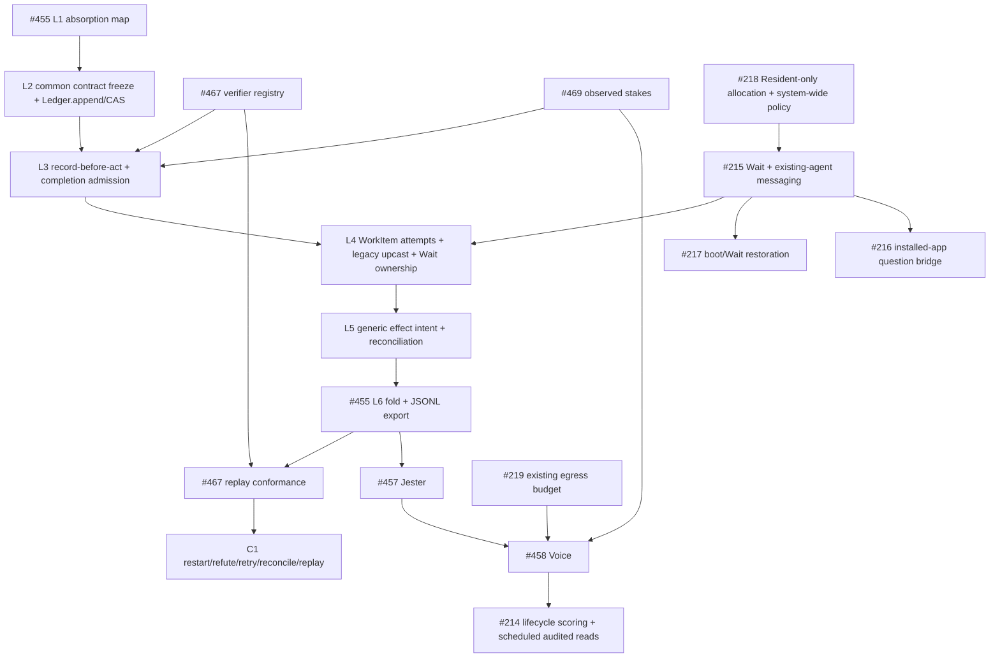

# Architecture — The Kernel in Code

This document maps [Core Model](core-model.md) onto the codebase: the target structure, the measured gap, and the migration order. Grounded in the 2026-07 full-package audit (42-agent adversarially-verified sweep) plus direct code inspection.

## Communication: Three Verbs, One Exception

Target: all communication is `ingress.submit` (world enters) / `dispatch.submit` (boundary crossed) / `bus.publish` (observation/projection only), with a same-domain Worker-local `child_agent` as the only non-gate path. The Resident never receives that path and alone originates new Worker allocations; granted messaging targets only already-existing agents and allocates nothing. Durable record-before-act is a separate ledger operation, not a communication verb.

The audit found seven paths; current reconciliation status:

| # | Path | Verdict |
|---|---|---|
| 1 | `DispatchRuntime.submit` — policies + lifecycle events on the bus | ✅ the real gate |
| 2 | coordinator worker manager + supervisor process delivery | ✅ renamed to `deliver` and demoted to a typed driver beneath the worker dispatch handler (#478); no gate vocabulary remains in the coordinator's public API |
| 3 | Server-side PendingAsk/PendingInteraction correlation and routing back doors | ✅ resolved by unified kernel `resolveRoute` (#464, PR #485); server ingress now supplies normalized transport facts only |
| 4 | ingress re-implements worker spawn/cancel/deliver alongside dispatch | ✅ resolved by #464 / PR #485; one route decision selects the existing dispatch/ingress effect path |
| 5 | `createToolExecutor` double pipeline (agent + openomni nested) — audit events emitted twice | ✅ resolved by policy-contract enforcement PR #484 (#454); production tool dispatch uses one canonical policy pipeline |
| 6 | Bus is in-memory microtask fire-and-forget (errors swallowed), persistence bolted on separately | 🚧 current gap; see Ledger below |
| 7 | dispatch fabricates an agent-loop policy context (`steps: []`) | ✅ resolved by PR #484 (#454); dispatch supplies its real top-level structured context and no fabricated agent-loop fields |

## Ledger: `Ledger.append` Is the Write API

One append-only ledger. Target `Ledger.append(event, expectedHead)` is the durable, per-owner-key serialized compare-and-append used for record-before-act; sessions, traces, and work items are views. `bus.publish` remains a lossy observation/projection surface and neither writes the ledger nor enforces append ordering. The split is planned, not wired: the current Bus is in-memory microtask fire-and-forget with persistence bolted on separately, and [Implementation Status](implementation-status.md) is the shipped-state source of truth. `WorkerRun` is absorbed into `WorkItem.attempts`, ending the double bookkeeping.

Kernel requirement: **agent-greppable export** of transcripts and the ledger. The Governor's minimal target implementation is a scheduled coding-agent session with ambient selective raw-transcript/full-ledger query access (per Meta-Harness, arXiv:2603.28052 — improvement loops need selective access to raw traces; summaries are the losing ablation). The target access contract requires analysis-scoped audit, keeps raw payload outside user-facing sessions, and adds no write or loosening authority. Target ledger and export work belongs to #455; #467 consumes the export for replay and conformance.

Decisions from the 2026-07-09 handoff-hardening round: the export's physical form is **derived JSONL files** — SQLite stays the single source of truth, the export is regenerable and rotated, one wide flat event per line (see [Kernel Contract § State and the ledger fold](kernel-contract.md#state-and-the-ledger-fold)). On absorption, legacy WorkerRun/PendingAsk/PendingInteraction rows are **frozen read-only and upcast on read** — never dropped, never destructively backfilled. The hash chain stays on the write path; boot verifies the tail only (a broken tail is a `chain-break` event plus a Governor incident, never a boot refusal); full-chain verification survives solely as #226's offline restore-drill gate.

## Policy: Complete the Existing Hook Layer

**Target policy topology:** policy is a system-wide, actor-agnostic interception plane rather than a Worker subsystem. Resident, Worker, Jester, Governor, ingress, dispatch, memory, scheduling, tools, LLM connections, and writeback may receive registrations selected by actor profile and context. **Current wiring:** protocol provides 19 contract-grade points (`session.inbound.pre`, `dispatch.action.pre`, `run.lifecycle/turn/completion/error.*`, `prompt.context.pre`, `connection.llm.pre/post`, `tool.catalog/native/mcp.*`, `delegation.worker.pre/post`, `session.writeback.pre`); the shared agent loop, Worker path, ingress/dispatch, injection queue, server context middleware, and MCP guard dispatch their applicable points. Resident-specific profile selection, Jester/Governor attachment, and memory/schedule points remain target work called out below.

Current status and work remaining:

1. **Four new points + ID-grammar extension** (`memory|egress|work|schedule` prefixes): `memory.recall.pre` (scope filter), `egress.render.pre` (voice contract), `work.complete.pre` (evidence gate), `schedule.fire.pre` (cron constraints). Note: the grammar's `credential` prefix has zero registered points — consistent with the coordinator credentials/tool-permission code being dead (deleted in #461).
2. **Engine relocation is complete**: contracts live in protocol and `PolicyEngine` lives in `@openomni/policy` (ring 1), with `@openomni/agent` retaining only its agent-scoped facade and built-ins (#451).
3. **Canonical point dispatch is enforced**: `dispatchPoint` checks `requiredContext` before middleware, parses the executable point input schema, applies the point's default fail policy, and rejects runtime effects outside each registration's declared capability subset. Middleware receives an immutable full structured context snapshot; non-plain or non-cloneable context becomes `input_invalid` under the point's fail policy. Canonical audit records carry the point ID and version. `DispatchRuntime` supplies real top-level dispatch facts; fabricated agent-loop fields and the agent-type dependency are removed.
4. **Production point dispatch is complete; role-specific attachment is not**: the shared agent loop dispatches canonical run lifecycle/turn/completion/error, prompt-context, tool-catalog/native/MCP, and LLM-connection points, so the same interception machinery can govern Resident and Worker profiles. The OpenOmni injection queue, server context middleware, and server MCP guard also use canonical point dispatch. The production Worker-only `child_agent` path dispatches `delegation.worker.pre/post`. Worker spawn currently receives a stamped `PolicyPlan`; the Resident's judgment-only tool catalog and explicit profile-selected policy plan land with #218/P4. The legacy timing API remains only as an explicit external compatibility boundary.
5. Enforce the remaining rulebook in [Core Model § Policy](core-model.md#policy--the-cross-cutting-hook-layer), notably the meta-policy that gates policy changes themselves (Owner free / Governor tighten-only / others none).

Shipped invariant for the current Worker-only `child_agent` path: a Worker child-agent spawn dispatches `delegation.worker.pre` before construction, the child is bounded to the parent grant, and further nesting is denied. Completed, failed, and cancelled children dispatch `delegation.worker.post` exactly once; cancellation during construction is covered, and Bus audit carries the point ID and version. The Resident is never given this tool. This code-enforced behavior is scoped to the production `child_agent` implementation, not future communication mechanisms or the broader target chokepoint.

## Package Rings

```
ring 0  @openomni/protocol      schemas only ("structure over instruction", physically)
ring 1  @openomni/ledger        (rename of session) bus + session + work-item + trace + actor stores
        @openomni/policy        pure judgment + the relocated engine
ring 2  @openomni/llm           model access
        @openomni/coordinator   worker process driver — verb is deliver, never a gate
ring 3  @openomni/agent         the LLM execution loop
ring 4  @openomni/kernel        (rename + shrink of openomni) ingress + dispatch
ring 5  apps/server             channel adapters + composition root; zero direct ledger imports
```

Each ring depends only inward. `check-deps` gets real rules (the current openomni/server any-except-self rule is vacuous); a shared tsconfig base ends the 8-way drift. **Resident, Governor, Jester, and Voice are not packages** — they are actor profiles and components running on the kernel (userland), which is the code translation of "all four roles are just actors".

## Extraction / Merge / Delete Ledger

**Extract (wrong home → right home):** PolicyEngine agent → policy (done — #451); Bus session → ledger core; PendingAsk correlation server → kernel.

**Merge (two implementations → one):** WorkerRun → WorkItem.attempts; ingress's worker spawn/cancel/deliver → dispatch handlers (coordinator becomes the `deliver` driver beneath them); tool-executor double pipeline → one kernel path with a single audit emission; server session back doors → ledger/dispatch APIs.

**Delete (audit-confirmed dead, ~5–6k LOC):** openomni `extension/` (entire), `profile/`, and all of `skill/` (done — #453 sweep; the audit expected SkillLoader to survive, but its only importers were `extension/*` and the server has its own SkillLoader) — the policy resolver, initially listed here as orphaned, is instead retained and wired by #462's gate-side stamping; server connector registry/discovery/definitions and `router.ts` (done — #453 sweep; `resolveAgentName`'s result was discarded by `buildInboundEvent(_agentName)`); session storage drizzle tree + dep, Snapshot, backgroundTask adapter, WalMaintenance (done — #453 sweep); coordinator `credentials/` and `tool-permission/` (done — #461); 6 of 7 llm error classes (done — #453 sweep; **the llm retry stack survived reconciliation**: `processor/index.ts` drives `Retry.isRetryable/delay/sleep` on the production path — the audit's "unreachable, maxRetries: 0" only described the AI-SDK option, not the package's own loop); agent writeback-policy, empty tools barrel, write-only AgentRegistry (done — #453 sweep).

**Hygiene:** re-derived on post-sweep main and executed (the audit-time counts 31/68 and 29 described the pre-#473 tree): 1 re-export-only barrel inlined (`event/index.ts` — the dead-code sweep had already removed the rest of the farm), 20 sub-30-LOC single-importer micro-files merged into their importers, cheap standalone-"runtime" string fixes applied. Structural "runtime" renames (`DispatchRuntime`, `ResidentRuntime`, `execution-runtime/`, `agent/src/runtime/`, the `InboundEvent.runtime` protocol field — a Greg-Young-lint upcast case, never a rename) are P3 surface (#456/#465).

**Recurrence guard: abstraction is earned.** No extraction before a second consumer exists — the same evidence-based promotion pattern as Workers and data ingestion. Every dead module above was a pre-extracted abstraction.

## Code Conventions (absorbed from ADR-001–004)

- **Namespaces over classes.** Public API is `Namespace.method()`, never `new Class()`. `new` is internal-only; no inheritance hierarchies; state via module-level variables or injected `configure()` patterns. Sole exception: `NamedError.create()` (needed for `instanceof`).
- **Zod-first types.** Every cross-package contract is a Zod schema first, `z.infer<>` second, sharing one name. No standalone `interface` for shared contracts; validate at boundaries with `.parse()`; discriminated unions for state shapes. Runtime-only members extend via `&` intersection.
- **Strict inward dependencies.** Each ring depends only inward (see rings above); reverse imports are build failures; cross-package imports go through the root barrel only — no deep imports. The server must not import the agent loop directly; all agent work flows through the kernel. Enforced by `script/check-deps.ts` in CI.
- **Stateless ChatAgent.** The agent loop is a function-style primitive (messages + tools in, events out via `AsyncGenerator`); it owns no session lifecycle or durable state — sinks and transports are injected. Session-backed orchestration lives above it. Extension happens through the policy engine, not subclassing.
- **Native tools first.** First-party capabilities are in-process native tools; MCP is reserved for genuinely external boundaries. Wrapping our own code behind MCP adds a serialization hop and hides it from the policy pipeline.
- **Scheduling is deferred ingress.** A scheduled job is `ingress.submit` with a later timestamp — there is no separate queue subsystem or queue tool; cron fires back into the same single entry path.

## Known Bugs (audit-confirmed)

All three audit-confirmed bugs are **fixed** by P0 bug-fix PR #471 (tracked by #453):

1. ~~llm model-catalog weekly refresh writes to `src/provider/` while the runtime reads `src/model/` — the catalog never updates.~~ Generator and workflow now write the reader's path `packages/llm/src/model/models-snapshot.json`; the snapshot was regenerated live in the same change.
2. ~~`run.ts adaptStream` is an ai-v4 shim duplicating v6 `text-start/end` — emits empty text parts.~~ The v4 shim is gone; `adaptStream` only renames v6 `start-step`/`finish-step` to the internal `step-start`/`step-finish`. A discrimination test asserts one non-empty text part per v6 text block.
3. ~~Resident agent definition drifts across 3 sites (stale hardcoded model fallback).~~ `DEFAULT_DISPATCH_MODEL` (`packages/openomni/src/dispatch/owners.ts`) is now the single kernel-side fallback, consumed by ingress session resolution and the server resident bridge.

## Migration Phases

### P2–P4 execution map

This is the target dependency order, not shipped-state evidence. [Implementation Status](implementation-status.md) remains the source of truth for current wiring.



**L2 contract freeze.** Before L3–L6 consumers land, freeze the versioned common event envelope/owner key; attempt identity and fingerprints; verifier verdict and `checkedPredicate`; stakes reference; Wait `ownerRef` and correlation; generic effect-intent/idempotency; schema/upcast/patch markers; and environment/nondeterminism manifests. Semantic changes require a new version/event and coordinated updates, never field re-meaning. First-consumer joins are fixed: #467's verifier registry → L3; #467 replay conformance consumes L6's fold/JSONL export before C1; #469 → L3; and #215 → L4.

**C1 fixture — `C1-restart-refute-reconcile-replay`.** Resident creates WorkItem W with criteria and appends before delivery. Attempt A receives a unique `attemptId`/`attemptSeq`, sends an awaited granted message to existing agent E with no allocation delta, and appends a W-owned Wait. After the process exits, restart folds the Wait, correlates E's reply, and resumes without allocating a Worker. A submits known-bad evidence; #467 at L3 returns `refuted + checkedPredicate`, W remains incomplete, and no completion effect occurs. Retry B receives a distinct ID/sequence with `retryOf=A`; unchanged canonical task/model/environment let A and B share equivalence keys while both rows persist. B appends generic effect intent I, performs one idempotent fake effect, then crashes before confirmation; restart reconciles I under the same key, proves exactly one effect, and completes only on accepted evidence. JSONL/sidecars include attempt identity/fingerprints, Wait/reply, refutation, intent/reconcile, and completion. Replay by `replayKey` and nondeterminism manifest produces the identical commands and final fold, proves legacy upcast, fails loudly on a perturbed reducer or missing input, and performs zero live effects.

The pre-existing C2 boundary remains #215 + #216; this roadmap synchronization does not expand its fixture.

### Phase summary
| Phase | Content |
|---|---|
| **P0 clean — complete** | ✅ Coordinator dead-module/double-ledger cleanup opened the phase in #461; the 3 bug fixes, conformance-gate exit slice, remaining dead-code sweep, deprecated-field removal, and post-sweep hygiene shipped in #471/#472/#473/#475/#476 |
| **P1 one channel — complete** | ✅ The coordinator/worker-driver P1 slice shipped in #477–#481: injected ports and a session-free coordinator, typed `deliver`, gate-side policy-plan stamping, one pool with supervisor options, and driver lifecycle/wall-time enforcement. #484 completed executable contracts and canonical enforcement for all 19 policy points, including production run/prompt/tool/LLM dispatch and gated `child_agent` delegation. #485 completed the single kernel `resolveRoute` pipeline, removed server routing back doors, and made each inbound publish exactly one `RoutingDecision` before selected effects or execution. The legacy timing API remains only at the explicit external compatibility boundary. `@openomni/ipc` extraction from #462 is a P3 package-ring tail, not unfinished P1 scope |
| **P2 one ledger** | Target: #455 owns L1 absorption map → L2 common contract freeze plus `Ledger.append`/CAS → L3 record-before-act and completion admission → L4 WorkItem attempts, legacy upcast, and Wait → L5 generic effect intent/reconcile → L6 fold and JSONL export. #467 owns the verifier registry joining L3 and the replay-conformance consumer joining after L6 before C1; #469 joins L3, and #215 joins L4. |
| **P3 rings** | package moves/renames, real check-deps rules, tsconfig base |
| **P4 roles** | Target: Resident becomes a judgment-only shell with no `child_agent` and sole Worker-allocation authority; Worker coordination remains same-domain child agent, granted existing-agent message, or `resident.ask`; Jester is the seven-lens silence/one-challenge detector; kernel policy/stakes/budget gates authorized egress through Voice and dispatch; Governor scores the lifecycle and runs scheduled analysis with scoped/audited ambient raw reads and no raw user-session projection or added write authority. |
